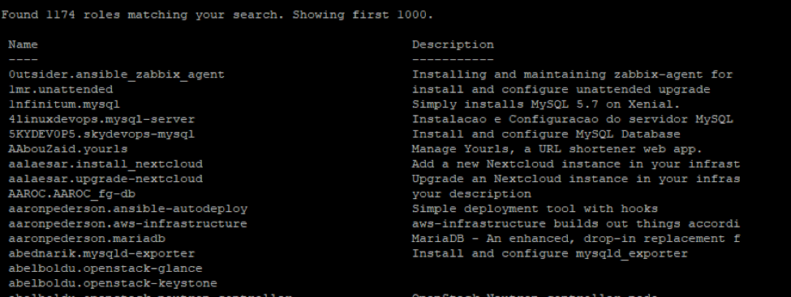
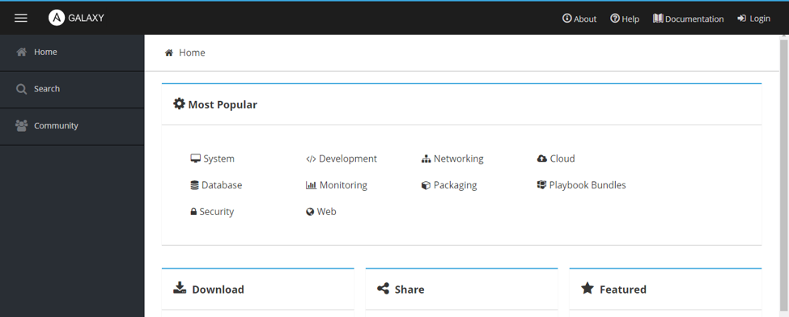
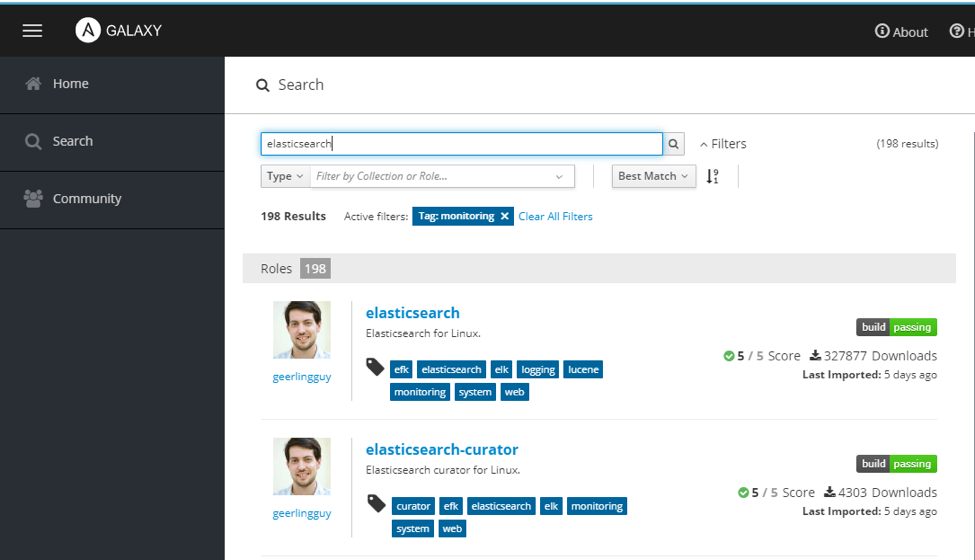
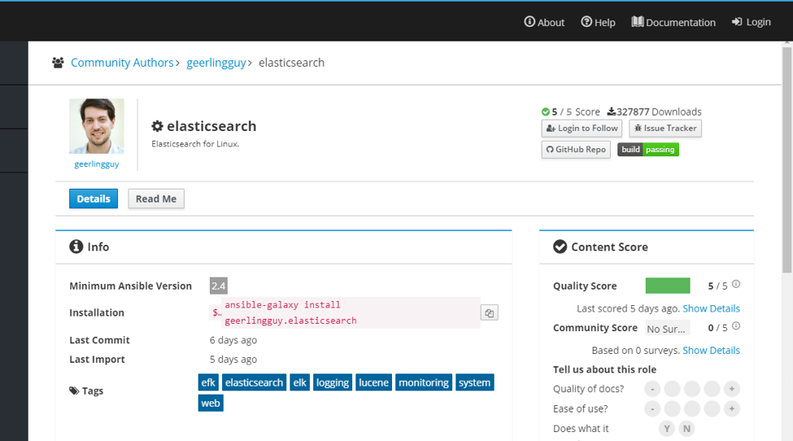

Lab 6 – Ansible Roles
==
# Créer un rôle Ansible

Pour créer un rôle dans Ansible , utilisez simplement la syntaxe.
```
$ ansible-galaxy init <role_name>
```
Plusieurs répertoires et fichiers seront créés dans votre répertoire de
travail actuel. Dans ce cas, on va créer un rôle dans le répertoire de
travail**.**

Créons un rôle appelé **apache**.
```
$ ansible-galaxy init apache
```
Utilisez la commande **tree** pour avoir un aperçu de la structure de
répertoires du rôle.
```
[master]$ tree apache/

apache/
├── defaults
│ └── main.yml
├── files
├── handlers
│ └── main.yml
├── meta
│ └── main.yml
├── README.md
├── tasks
│ └── main.yml
├── templates
├── tests
│ ├── inventory
│ └── test.yml
└── vars
└── main.yml
```
Comme vous pouvez le voir, plusieurs répertoires ont été créés,
cependant, ils ne seront pas tous utilisés dans le playbook.

Maintenant, pour utiliser votre nouveau rôle dans un playbook,
Vous trouverez ci-dessous un exemple de codes de playbook pour déployer le serveur Web Apache.
```
---
- hosts: all
  tasks:
  - name: Install httpd Package
    yum: name=httpd state=latest
  - name: Copy httpd configuration file
    copy: src=/data/httpd.original dest=/etc/httpd/conf/httpd.conf
  - name: Copy index.html file
    copy: src=/data/index.html dest=/var/www/html
    notify:
    - restart apache
  - name: Start and Enable httpd service
    service: name=httpd state=restarted enabled=yes
  handlers:
  - name: restart apache
    service: name=httpd state=restarted
```
Accédez au répertoire `apache` et éditez votre rôle:
1. Tasks:
Editez main.yml disponible dans le dossier des tâches pour définir les tâches à exécuter.
```
vi tasks/main.yml
```
```yaml
---
- name: Install httpd Package
  yum: name=httpd state=latest
- name: Copy httpd configuration file
  copy: src=/data/httpd.original dest=/etc/httpd/conf/httpd.conf
- name: Copy index.html file
  copy: src=/data/index.html dest=/var/www/html
  notify:
  - restart apache
- name: Start and Enable httpd service
  service: name=httpd state=restarted enabled=yes
```
Au total, vous pouvez ajouter toutes vos tâches dans ce fichier ou simplement casser les codes encore plus comme ci-dessous en utilisant des instructions **import_tasks**.
```
cat tasks/main.yml
```
```yaml
---
# tasks file for apache
- import_tasks: install.yml
- import_tasks: configure.yml
- import_tasks: service.yml
```
* install.yml
```
cat tasks/install.yml
```
```YAML
---
- name: Install httpd Package
  yum: name=httpd state=latest
```
* configure.yml
```
cat tasks/configure.yml
```
```yaml
---
- name: Copy httpd configuration file
  copy: src=files/httpd.conf dest=/etc/httpd/conf/httpd.conf
- name: Copy index.html file
  copy: src=files/index.html dest=/var/www/html
  notify:
  - restart apache
```
* service.yml
```
cat tasks/service.yml
```
```yaml
---
- name: Start and Enable httpd service
  service: name=httpd state=restarted enabled=yes
```

2. Files
Copiez les fichiers requis (httpd.conf et index.html) dans le répertoire des fichiers.

3. Handlers
Modifiez **main.yml** du handlers  pour redémarrer le serveur en cas de modification.
Parce que nous l'avons déjà défini dans les tâches avec l'option `notify`.
Utilisez le même nom "`restart apache`" dans le fichier main.yml que ci-dessous.
```
cat handlers/main.yml
```
```yaml
---
# handlers file for apache
- name: restart apache
  service: name=httpd state=restarted
```

Nous avons tous les fichiers requis pour le rôle Apache.
Essayons d'appliquer ce rôle dans le playbook "install_apache.yml" comme ci-dessous pour le déployer sur les nœuds clients.
```
cat install_apache.yml
```
```YAML
---
- hosts: webservers
  become: yes
  roles:
  - apache
```

### Installer un rôle depuis Ansible Galaxy

Ansible Roles jouent un rôle crucial dans le partage de code avec
d'autres utilisateurs de la communauté Ansible à l'aide de la
plate-forme Ansible Galaxy. Dans Ansible Galaxy , vous obtenez des
milliers de rôles effectuant différentes tâches telles que
l'installation de serveurs Web et de bases de données, d'outils de
monitoring , etc.

Ansible Galaxy est une base de données ou un référentiel de rôles
Ansible que vous pouvez exploiter dans vos playbooks.

Pour rechercher un rôle dans Ansible Galaxy , exécutez simplement la
commande.
```
$ ansible-galaxy search <role>
```
Par exemple, pour rechercher un rôle nommé mysql, exécutez.
```
$ ansible-galaxy search mysql
```


Comme vous pouvez le voir, il existe des centaines de rôles qui
correspondent au mot-clé *mysql* . Cependant, tous les rôles
n'effectuent pas ce que vous souhaitez, il est donc recommandé de lire
attentivement les instructions.

Pour collecter plus d'informations sur un rôle, exécutez simplement la
commande Ansible:
```
$ ansible-galaxy info 5KYDEV0P5.skydevops-mysql
```
Dans notre exemple, nous allons installer le rôle
5KYDEV0P5.skydevops-mysql .
```
$ ansible-galaxy install 5KYDEV0P5.skydevops-mysql
```
> - downloading role 'skydevops-mysql', owned by 5KYDEV0P5
>
> - downloading role from
https://github.com/5KYDEV0P5/skydevops-mysql/archive/v1.0.3.tar.gz
>
> - extracting 5KYDEV0P5.skydevops-mysql to
/home/vagrant/.ansible/roles/5KYDEV0P5.skydevops-mysql
>
> - 5KYDEV0P5.skydevops-mysql (v1.0.3) was installed successfully

Le rôle est téléchargé et extrait dans le répertoire des rôles par
défaut situé dans /etc/ansible/roles.

Le rôle peut ensuite être appelé dans un playbook, par exemple:
```yaml
---
- name: Install MySQL server
  hosts: dbservers
  roles:
  - 5KYDEV0P5.skydevops-mysql
```
Vous pouvez maintenant exécuter en toute sécurité le playbook Ansible
comme indiqué.
```
$ ansible-playbook install_mysql.yml
```
De plus, vous pouvez visiter Ansible Galaxy via votre navigateur Web et
rechercher manuellement des rôles pour effectuer diverses tâches, comme
indiqué par le tableau de bord.



Par exemple, pour rechercher un rôle tel que elasticsearch, cliquez sur
l'option « Monitoring » et recherchez le rôle comme indiqué.



Ansible Galaxy permet aux utilisateurs d'installer plus facilement les
meilleurs rôles en répertoriant les rôles les plus populaires et les
plus téléchargés. Pour obtenir plus d'informations sur un rôle
spécifique, cliquez simplement dessus.



Vérifiez les informations de rôle sur Ansible Galaxy

Dans un playbook, vous pouvez également spécifier plusieurs rôles, par
exemple.
```yaml
---

- name: Install MySQL server
  hosts: dbservers
  roles:
  - 5KYDEV0P5.skydevops-mysql
  - Aaronpederson.mariadb
```
Pour lister les rôles installés, exécutez simplement.
```
$ ansible-galaxy list
```

## Inclure un Ansible Role dans une tâche
Vous pouvez réutiliser des rôles de manière dynamique n'importe où dans la section des tâches d'un play en utilisant `include_role`. Alors que les rôles ajoutés dans la section **roles:** s'exécutent avant toute autre tâche dans un playbook, les rôles inclus s'exécutent dans l'ordre dans lequel ils sont définis. S'il existe d'autres tâches avant une tâche `include_role`, les autres tâches seront exécutées en premier.

Pour inclure un rôle:

```YAML
---
- hosts: webservers
  tasks:
    - name: Print a message
      debug:
        msg: "this task runs before the example role"

    - name: Include the example role
      include_role:
        name: example

    - name: Print a message
      debug:
        msg: "this task runs after the example role"

```
Vous pouvez inclure conditionnellement un rôle:
```yaml
---
- hosts: webservers
  tasks:
    - name: Include the some_role role
      include_role:
        name: some_role
      when: "ansible_facts['os_family'] == 'RedHat'"
```

###Challenge
Créez un playbook pour installer **Apache** dans tous les noeuds CentOS et Ubuntu
en utilisant les Ansible Roles,
Vous aurez besoin de considérer le *fact* `os_family` pour décider quel rôle à inclure.

##Conclusion

Les rôles facilitent la réutilisation et le partage des playbooks
Ansible. De cette façon, ils font gagner beaucoup de temps à
l'utilisateur en essayant d'écrire beaucoup de code redondant qui aurait
été utilisé dans d'autres tâches d'administration système.


---
[Next Lab ->](./Lab%208%20-%20Ansible%20Vault.md)
