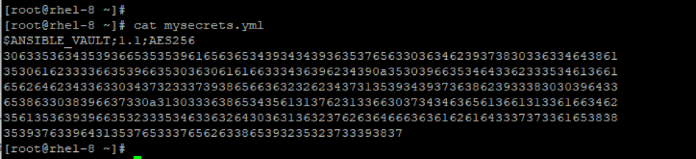

Lab 8 – Ansible Vault
==
Lorsque vous utilisez Ansible, vous devez probablement saisir des
informations confidentielles ou secrètes dans des playbooks. Cela inclut
les clés privées et publiques SSH, les mots de passe et les certificats
SSL pour n'en citer que quelques-uns. Comme nous le savons déjà, cette
mauvaise pratique consiste à enregistrer ces informations sensibles en
texte brut pour des raisons évidentes. Ces informations doivent être
conservées sous clé car nous ne pouvons qu'imaginer ce qui se passerait
si des pirates informatiques ou des utilisateurs non autorisés en
avaient la possession.

Heureusement, Ansible nous fournit une fonctionnalité pratique appelée
Ansible Vault . Comme son nom l'indique, Ansible Vault permet de
sécuriser les informations secrètes vitales, comme nous l'avons vu
précédemment. Ansible Vault peut chiffrer des variables, voire des
fichiers entiers et des playbooks YAML, comme nous le démontrerons plus
tard. C'est un outil très pratique et convivial qui nécessite le même
mot de passe lors du cryptage et du décryptage des fichiers.

## Créer un fichier chiffré (crypté) dans Ansible

Si vous souhaitez créer un fichier Playbook chiffré, utilisez simplement
la commande *ansible-vault create* et indiquez le nom du fichier
playbook.

```
$ ansible-vault create playbook_name
```

Par exemple, pour créer un fichier crypté `mysecrets.yml`, exécutez la
commande:

```
$ ansible-vault create mysecrets.yml
```
Vous serez ensuite invité à entrer un mot de passe, et après l'avoir
confirmé, une nouvelle fenêtre s'ouvrira en utilisant l'éditeur vi où
vous pourrez commencer à écrire vos plays.


Pour vérifier le cryptage du fichier, utilisez la commande *cat*.



### Afficher un fichier crypté dans Ansible

Si vous souhaitez afficher un fichier chiffré, passez simplement la
commande *ansible-vault view* comme indiqué ci-dessous.
```
$ ansible-vault view mysecrets.yml
```
Vous serez invité à entrer le mot de passe. Et encore une fois, vous
aurez accès à vos informations.

### Modifier un fichier crypté dans Ansible

Pour apporter des modifications à un fichier chiffré, utilisez la
commande d'édition *ansible-vault edit* comme indiqué.
```
$ ansible-vault edit mysecrets.yml
```
Comme toujours, indiquez le mot de passe et procédez ensuite à l'édition
du fichier. Une fois les modifications terminées, enregistrez et quittez
l'éditeur vim.

### Changer le mot de passe Ansible Vault

Si vous ressentez le besoin de changer le mot de passe du Ansible vault,
vous pouvez facilement le faire en utilisant la commande
`ansible-vault rekey` comme indiqué ci-dessous.
```
$ ansible-vault rekey mysecrets.yml
```
Cela vous demande le mot de passe actuel et vous demande plus tard
d'entrer le nouveau mot de passe et de le confirmer.

### Chiffrer un fichier non chiffré dans Ansible

Supposons que vous souhaitez chiffrer un fichier non chiffré, vous
pouvez le faire en exécutant la commande *ansible-vault encrypt* comme
suit.
```
$ ansible-vault encrypt classified.yml
```
Cela vous demande le mot de passe actuel et vous demande plus tard
d'entrer le nouveau mot de passe et de le confirmer.

### Déchiffrer un fichier chiffré

Pour afficher le contenu d'un fichier crypté, décryptez simplement le
fichier en utilisant `ansible-vault decrypt` comme illustré dans
l'exemple ci-dessous.
```
$ ansible-vault decrypt classified.yml
```
### Crypter des variables spécifiques dans Ansible

De plus, Ansible vault vous donne la possibilité de chiffrer certaines
variables. Cela se fait à l'aide de la commande *ansible-vault
encrypt_string* comme indiqué ci-dessous.
```
$ ansible-vault encrypt_string
```


Ansible Vault vous demandera le mot de passe et vous demandera plus tard
de le confirmer. Ensuite, tapez la valeur de chaîne que vous souhaitez
crypter. Enfin, appuyez sur `Ctrl + d`. Par la suite, vous pouvez
commencer à attribuer la valeur cryptée dans un playbook.

Ceci peut être réalisé en une seule ligne comme indiqué ci-dessous.
```
$ ansible-vault encrypt_string 'string' --name 'variable_name'
```


**Déchiffrer un fichier de Playbook pendant l'exécution**

Si vous avez un fichier de playbook et que vous souhaitez le déchiffrer
pendant l'exécution, utilisez l'option --ask-vault-pass comme illustré.
```
$ ansible-playbook deploy.yml --ask-vault-pass
```


Cela décrypte tous les fichiers utilisés dans le playbook à condition
qu'ils ont été cryptés à l'aide du même mot de passe.

Les invites de mot de passe peuvent parfois être ennuyeuses. Ces invites
rendent l'automatisation intenable, en particulier lorsque
l'automatisation est essentielle. Pour rationaliser le processus de
décryptage des playbooks pendant l'exécution, il est recommandé de
disposer d'un fichier de mot de passe distinct contenant le mot de passe
de Ansible Vault. Ce fichier peut ensuite être transmis pendant
l'exécution comme indiqué.
```
$ ansible-playbook deploy.yml --vault-password-file vault_pass.txt
```

---
[Next Lab ->](./Lab%209%20-%20Ansible%20Tower.md)
